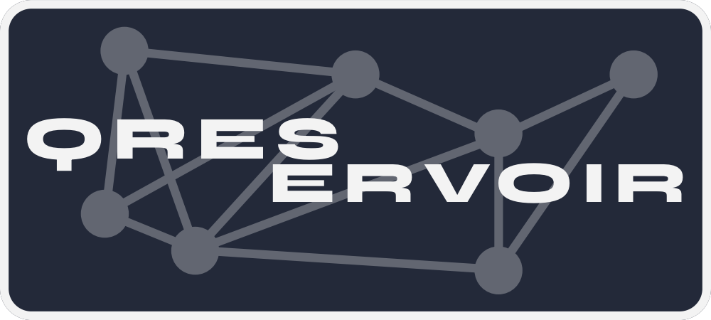

<p align="center">
  
</p>

# Qreservoir

[](https://github.com/psf/black)


Qreservoir is a lightweight python package built on top of qulacs to simulate quantum extreme learning and quantum reservoir computing models.

Qreservoir is licensed under the [MIT license](https://github.com/owenagnel/qreservoir/blob/main/LICENSE).

## Tutorial and API documents

Documentation and API: [https://owenagnel.github.io/qreservoir](https://owenagnel.github.io/qreservoir).

## Quick Install for Python

```
pip install qreservoir
```

Uninstall Qreservoir:

```
pip uninstall qreservoir
```

## Features

Fast simulation of quantum extreme learning machine and quantum reservoir computing. 


### Python sample code

```python
from qulacs import Observable
from sklearn.linear_model import LinearRegression

from qreservoir.datasets import Complex_Fourrier
from qreservoir.encoders import ExpEncoder
from qreservoir.models import QELModel
from qreservoir.reservoirs import RotationReservoir

dataset = Complex_Fourrier(complexity=1, size=1000, noise=0.0)

encoder = ExpEncoder(1, 1, 3) # 1 feature, 1 layer, 1 qubit per feature
reservoir = RotationReservoir(encoder, 0, 10)  # 0 ancilla qubits, 10 depth

observables = [Observable(3) for _ in range(9)] # create observable set
for i, ob in enumerate(observables[:3]):
    ob.add_operator(1.0, f"X {i}")
for i, ob in enumerate(observables[3:6]):
    ob.add_operator(1.0, f"Z {i}")
for i, ob in enumerate(observables[6:]):
    ob.add_operator(1.0, f"Y {i}")

model = QELModel(reservoir, observables, LinearRegression()) # observable is a qulacs Observable object
X, _, y, _ = dataset.get_train_test()
model.fit(X, y)
print(model.score(X, y))
```

## How to cite

N/A

## Future improvements

- Model creation currently a bit clunky. Models should take encoders and reservoirs as two seperate arguments and size of inputs should be determined dynamically when fit/score are called. This is made more difficult by the fact we wish to extract variance and concentration data from the models. Ideally we want `RCModel` and `QELModel` to implement scikit-learn's `BaseEstimator` interface.

- Additional tests should be written for datasets and new reservoirs/encoders

- Improve package structure by using python specific object oriented features. 